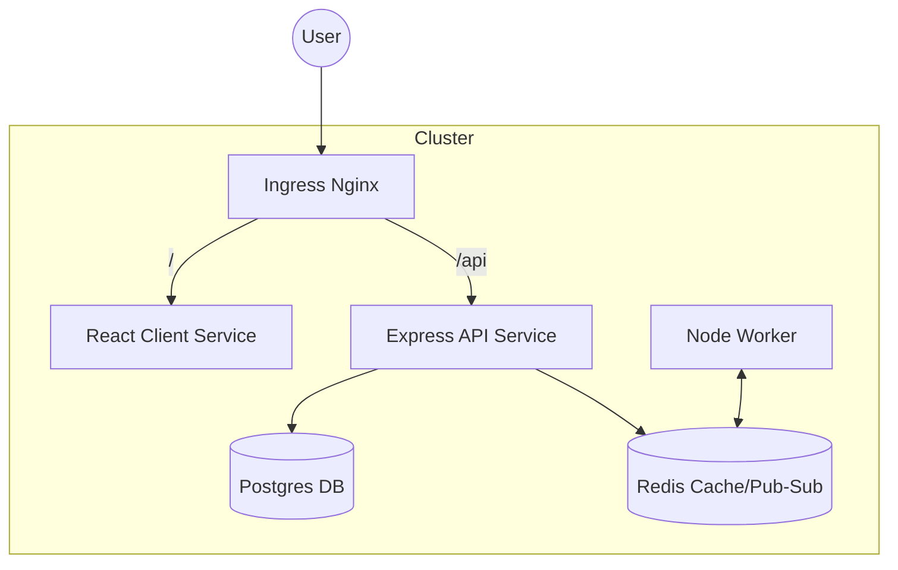

# 🚀 Multi-Container Fibonacci Calculator (Kubernetes)

!Kubernetes
!Docker
!React
!NodeJS
!Redis
!Postgres

A production-grade, distributed system architecture deployed on Kubernetes. This application calculates Fibonacci sequences using a decoupled worker-based pattern to handle intensive computation without blocking the API.

## 🏗️ Architecture Overview



### System Components
1.  **React Client**: Frontend dashboard for user interaction.
2.  **Express Server**: Gateway API handling persistent storage and task queuing.
3.  **Worker (Node.js)**: Background processor monitoring Redis for new tasks.
4.  **Redis**: Serves as a low-latency cache and a Message Broker (Pub/Sub).
5.  **PostgreSQL**: Provides relational data persistence for request history.

## 📂 Project Structure

```text
complex-gh/
├── client/           # React frontend
├── server/           # Node/Express backend API
├── worker/           # Background calculation logic
└── k8s/              # Kubernetes manifest files
    ├── client-deployment.yaml
    ├── server-deployment.yaml
    ├── worker-deployment.yaml
    ├── ingress-service.yaml
    └── ...           # Redis & Postgres configs
```

## 🚦 Routing & Ingress

This project utilizes the **Ingress-Nginx Controller** to manage cluster entry points. It implements path-based routing and regex-based path rewriting:

-   `/` → `client-cluster-ip-service:3000`
-   `/api/(.*)` → `server-cluster-ip-service:5000/$1`

## 🚀 Getting Started

### Prerequisites
- Docker Desktop (Kubernetes enabled) or Minikube.
- Ingress-Nginx Controller:
  ```bash
  kubectl apply -f https://raw.githubusercontent.com/kubernetes/ingress-nginx/controller-v1.15.1/deploy/static/provider/cloud/deploy.yaml
  ```

### 1. Setup Secrets
```bash
kubectl create secret generic pgpassword --from-literal=PGPASSWORD=your_db_password
```

### 2. Deploy to Kubernetes
```bash
kubectl apply -f k8s/
```

## 🛠️ Technical Implementation

### Distributed Task Handling
To handle high-latency Fibonacci calculations, the system employs an event-driven flow:
1. **API** receives an index and writes to **Postgres**.
2. **API** pushes the index to **Redis** and notifies the **Worker** via Pub/Sub.
3. **Worker** performs recursive calculation and stores results in **Redis**.
4. **Client** retrieves real-time results from Redis and history from Postgres.

## 🛡️ Production Considerations

For a true production environment, the following enhancements would be prioritized:

-   **Horizontal Pod Autoscaling (HPA)**: Scaling the `worker` pods based on CPU/Memory usage during high calculation demand.
-   **Persistent Volume Claims (PVC)**: Moving beyond basic `cluster-ip` for Postgres to ensure data survives pod restarts on cloud providers (AWS EBS/GCP PD).
-   **Network Policies**: Restricting traffic so only the `server` and `worker` can communicate with Redis/Postgres.
-   **Helm Charts**: Templating these manifests for environment-specific deployments (Dev/Staging/Prod).
-   **Readiness/Liveness Probes**: Ensuring the Ingress only routes traffic to healthy pods.

---
*Developed as a showcase for distributed systems and Kubernetes orchestration.*
